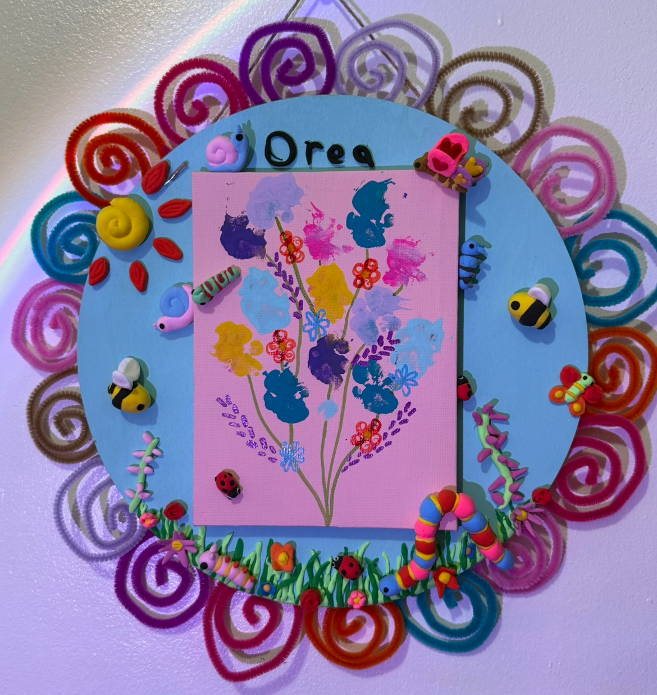
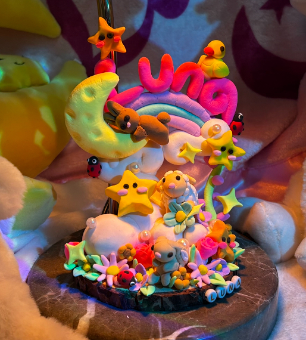
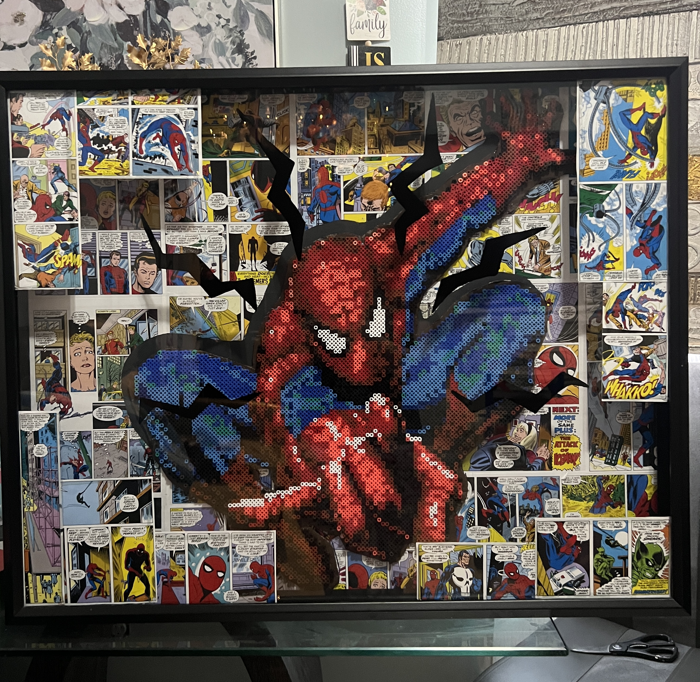
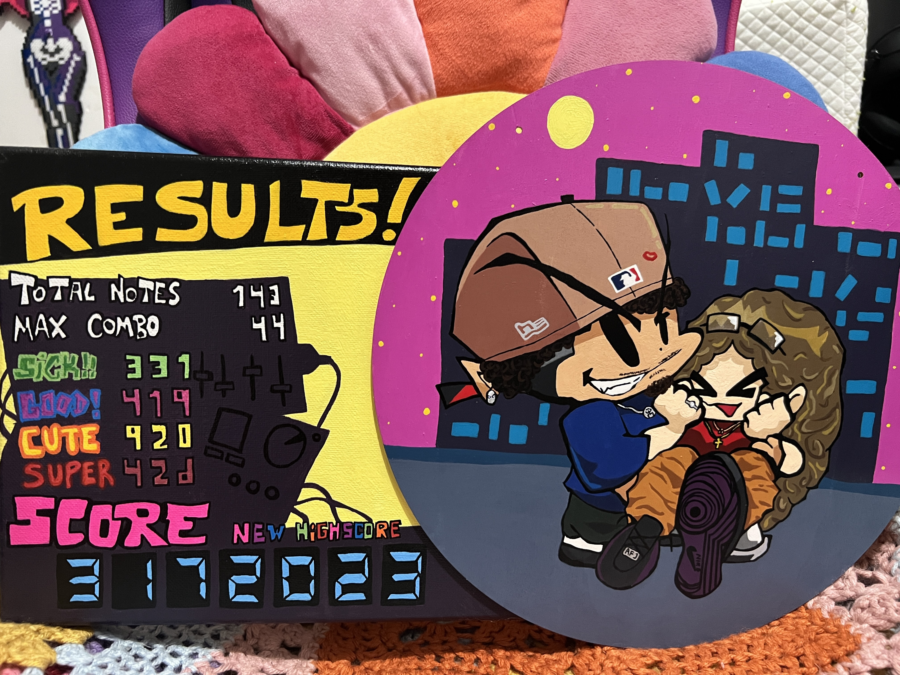

## Hi! I'm Ivette 👋

Im a senior at Fordham University majoring in Computer Science and minoring in Anthropology.

- 🔭 I’m currently working on further developing my SQL abilities in my Information and Data Management class.
- 🌱 I’m currently learning and taking a class in Data Communication and Networks.
- 😄 Pronouns: She/Her

---

## 🛠 Skills & Technologies
C++ | Java | SQL | Web Development --> HTML/CSS/JavaScript/ PHP
Bilingual: Spanish and English (Oral and Written)

---

## 🎨 Interests
Mixed media art | Learning new skills | Photography 

  
  
  
  
  

---
